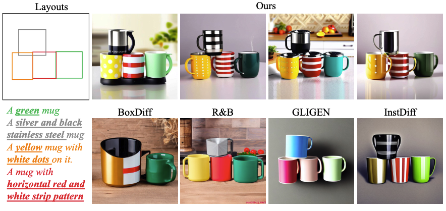
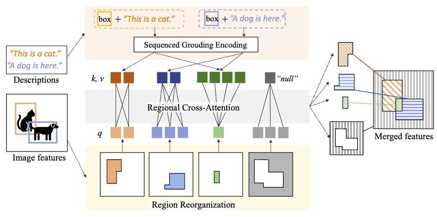
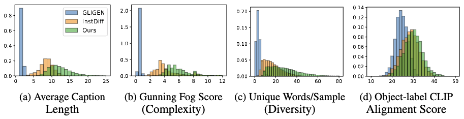

### Code release for [Rethinking The Training And Evaluation of Rich-Context Layout-to-Image Generation (NeurIPS 2024)](https://www.arxiv.org/pdf/2409.04847)




Working in progress... More contents coming soon...
See following instructions for preview experience


## Quick Demo
### Clone this repo
```
git clone git@github.com:cplusx/rich_context_L2I.git
cd rich_context_L2I
pip install -r requirements.txt
```
### Initialize the Foundational Model Weights for the UNet
```
python misc_utils/init_regional_unet.py --model_path hotshotco/SDXL-512 --save_path regional_attn_sdxl_512_init_weights --model_type ca
```
### Inference
Please see the `inference.ipynb` for using the Rich-context L2I with `diffusers`.
We have adapt our method to use a similar API like `diffusers` GLIGEN pipeline.
```
height = width = 512
GUIDANCE_SCALE = 5.0
caption = '' # You can leave it blank or give it a global caption if you have
object_file = 'demos/100002558.json'
with open(object_file, 'r') as f:
    objects = json.load(f)
    bboxes = np.array(objects['bboxes'])
    labels = objects['labels']

with torch.no_grad(), torch.cuda.amp.autocast(dtype=torch.float16):
    generated = pipe(
        prompt=caption,
        negative_prompt=NEGATIVE_PROMPTS,
        height=height, width=width,
        boxes=bboxes,
        labels=labels,
        scheduled_sampling_beta=1,
        num_inference_steps=50,
        guidance_scale=GUIDANCE_SCALE
    )
```
You can pass the labels and bounding boxes directly to the model, they need to be a list of strings and a 2D `numpy.array`.

## Generate Synthetic Data
Coming soon


## Training Your Own Model
To train your own model, you will need to:
* Prepare a dataset
* Modify the training configuration
* Initialize foundational diffusion model with regional cross-attention layers inserted
* Log in wandb account for visualization (if you have an account, though it is optional, we recommend you to visualize the training)
* Launch the training (optionally on multiple machines)

### Prepare a dataset
The folder `diffusion_dataset` contains training dataset creation scripts. You can create a synthetic dataset or use datasets with bounding boxes (like MSCOCO).
Each of your `__getitem__` function should return a dictionary like following:
```
{
    'image_path': string,
    'image': numpy.array, shape (c, h, w)
    'caption': string,
    'bboxes': numpy.array, shape (num objs, 4)
    'masks': numpy.array, shape (num objs, h, w) # not used during the model training
    'labels': [string], shape (num objs,)
}
```

### Modify the training configuration
Please ensure that you have modified the configuration accordingly before you start training. The following are most likely parts you need to edit (see [this file](configs/layout_sdxl.yaml) for example):
1. Number of GPUs
`devices: [0,1,2,3,4,5,6,7]`
2. Your dataset. Change the dataset classes under `data.train.params.subdatasets` or `data.val.params.subdatasets`. The sampling rates controlles the portion of images to be sampled from multiple subdatasets.

### Initialize foundational diffusion model with regional cross-attention layers inserted
The following function downloads a foundational diffusion model and insert the regional cross-attention layers to the model. You can also use the original SDXL, which is best for 1024x1024 resolution training. We choose to use 512 resolution since the original SDXL has low generation quality on 512 resolution and the `hotshotco/SDXL-512` is fine-tuned from the original SDXL for better 512 resolution generation.
```
python misc_utils/init_regional_unet.py --model_path hotshotco/SDXL-512 --save_path regional_attn_sdxl_512_init_weights --model_type ca
```
 
### Log in wandb account for visualization
Run the following command and paste your wandb token into the terminal
```
wandb login
```

### Launch the training
Use following command to train on a single machine, remember to modify the `devices: [0,1,2,3,4,5,6,7]` according to your machine.

`python train.py --config configs/layout_sdxl.yaml -r`

Training on multiple machines

`bash misc_utils/dist_train.sh [IP address of main node] [config file path] [number nodes]`


The IP address should be `127.0.0.1` for the main node, and IP address of main node for the children nodes. (Note, there is a (possible) bug in the pytorch-lightning, the checkpoints may not saved on the main node but on one of the children node.)

e.g., `bash misc_utils/dist_train.sh 172.31.42.68 configs/layout_sdxl.yaml 2` for children node and `bash misc_utils/dist_train.sh 127.0.0.1 configs/layout_sdxl.yaml 2` for the main node.

## Citation
If you find this work useful, please cite this work
```
@inproceedings{rich_context_l2i,
  title = {Rethinking The Training And Evaluation of Rich-Context Layout-to-Image Generation},
  author = {Cheng, Jiaxin and Zhao, Zixu and He, Tong and Xiao, Tianjun and Zhou, Yicong and Zhang, Zheng},
  journal = {Advances in Neural Information Processing Systems},
  year = {2024},
}
```


## Acknowledgement

This working is done during author's internship at Amazon. This codebase is a reimplementation of the work in the paper. 

Some of the code used in this work is adapted from [layout2img](https://github.com/wtliao/layout2img/tree/main), we appreciate the contributions of above authors.